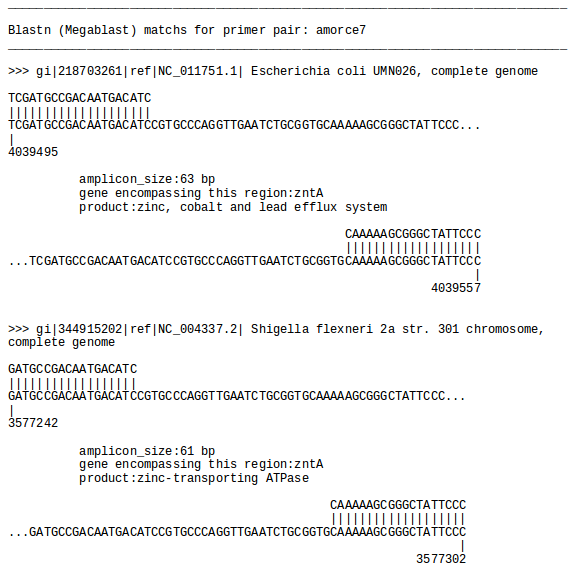

Amplicon_finder is a tool to test the specifity of pairs of primers (e.g. qPCR). It use the NCBIBlast+'s Biopython wrapper and python code to visualize the potential amplicons that can be produced by a pairs of primers.

Prerequisites

* NCBIBlast

* Biopython

* Download and install local NCBIBlast+ databases (e.g. Prokaryotic RefSeq Genomes)

Usage

* conda activate jupyter

* jupyter-notebook amplicon_finder.ipynb

* run the notebook
